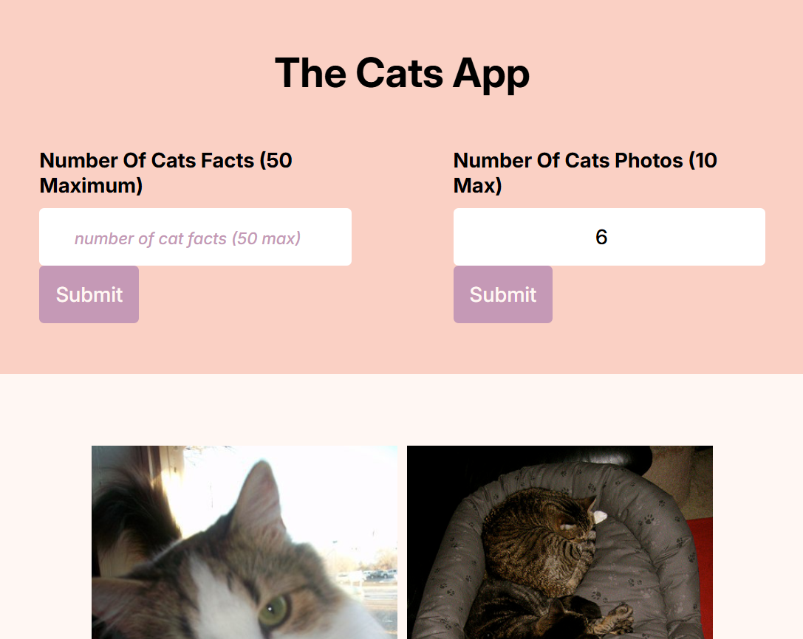

# THE CATS APP

## What is this repo

# 🐱 Cats App

 <details> <summary><b>🥄 Table of Contents</b> </summary>

- [📘 About This Repo](#-about-this-repo)
- [🧠 What is TheCatAPI?](#-what-is-thecatapi)
- [🪶 Features](#-features)
- [🫵 Try it Out](#-try-it-out)
- [📸 Screenshot](#-screenshot)
- [🛠️ Built With](#️-built-with)
- [📦 Getting Started](#-getting-started)
- [🧪 How to Use the Site](#-how-to-use-the-site)
- [🤔 How It Works](#-how-it-works)
- [❗ Error Handling](#-error-handling)
- [🙌 Acknowledgments](#-acknowledgments)
- [📜 License](#-license)
- [💬 Contact](#-contact)
- [Find Me At](#for-questions-confirmation-or-collaboration-find-me-at)
</details>

---

## 📘 About This Repo

**Cats App** is a lightweight JS  app that fetches and displays information about various cat facts using the [TheCatAPI](https://thecatapi.com/). It's a hands-on project built to strengthen understanding of API consumption using **Axios**.

### 🧠 What is TheCatAPI?

[TheCatAPI](https://thecatapi.com/) is a free, public API providing information and images of different cat breeds perfect for pet lovers, students, and developers experimenting with live data.

---

## 🪶 Features

- 🐾 Fetch and display data from TheCatAPI
- ⚡ Axios-powered HTTP requests
- 🖥️ Clean and simple UI with HTML CSS
- 🔄 Loading indicators and error handling
- 📚 Dynamic rendering of Cat Images and facts

---

## 🫵 Try it Out:

> Live Link: [The Cats App](https://cats-app-api.vercel.app/)

---

## 📸 Screenshot

 

---

## 🛠️ Built With

- JavaScript
- Axios
- HTML5
- CSS3
- [TheCatAPI](https://thecatapi.com/)

---

## 📦 Getting Started

1. Clone the repo:

```bash
git clone https://github.com/WaithakaGuru/cats-app.git
``` 

2. Navigate to the project folder:

```bash
cd cats-app
```

3. Install dependencies:

```bash
npm install
```

4. Start the dev server:

```bash
npm start
```
---

## 🧪 How to Use the Site
1. Open the app.

1. View the list of cat facts fetched in real-time.

1. Learn more about different Cat Facts .

---

## 🤔 How It Works
 - The app loads.

- Axios sends a GET request to TheCatAPI.

- The API responds with a JSON array of cat facts.

- The app maps through the data and renders it in the UI.

---

## ❗ Error Handling
- ⚠️ Displays a loading state while data is fetched.

❌ Shows an error message when:

- API request fails

- Data is unavailable

---

## 🙌 Acknowledgments
Thanks to TheCatAPI for providing the amazing free data.

Built as a self-learning challenge and inspired by fellow developers sharing their projects.

---

## 📜 License
No license for now.

---

## 💬 Contact
For questions, confirmation or collaboration find me at:
GitHub: [WaithakaGuru](https://github.com/WaithakaGuru)

Email: waithakaoffices@gmail.com

---

## Waithaka Amos Out!! 😺
